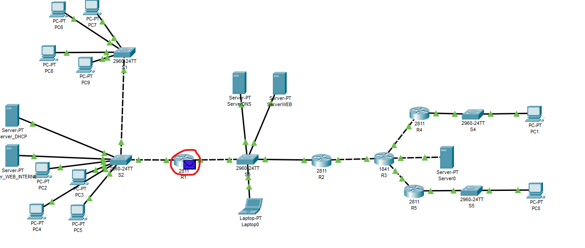
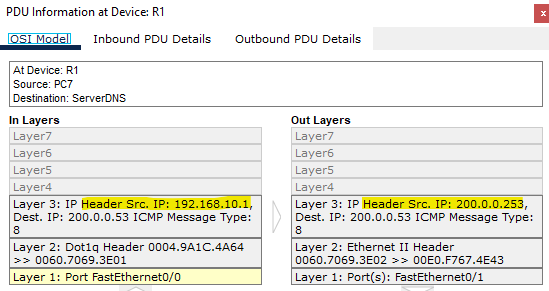
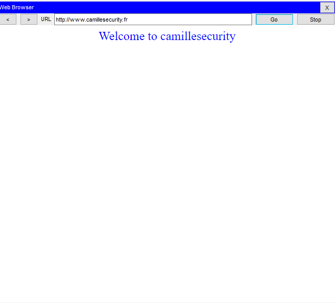
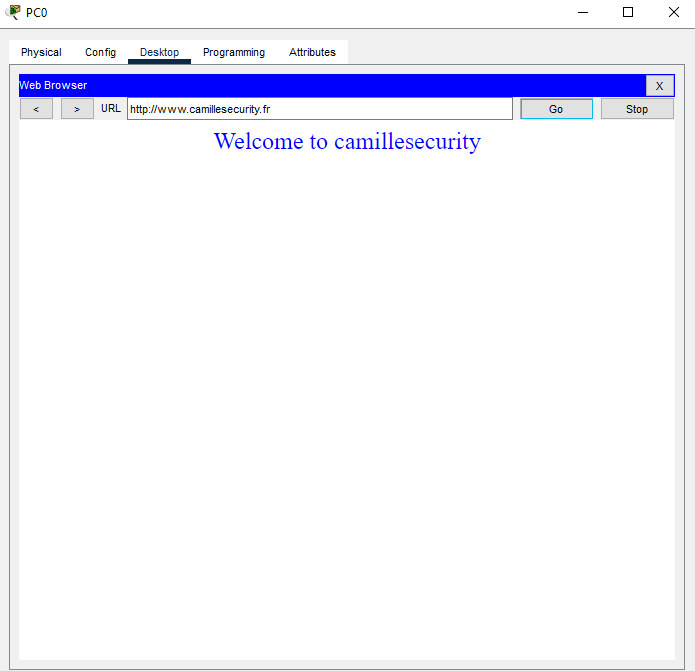
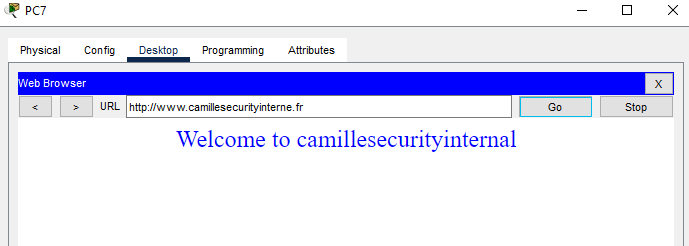
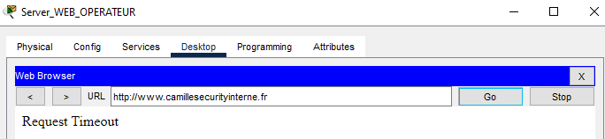
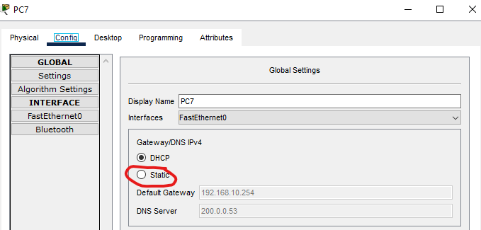
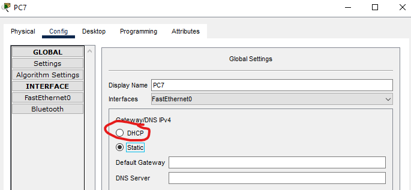

Protocoles de test
========================

## - NAT

Pour vérifier si la traduction d'adresse se fait correctement, il faut tout d'abord faire un ping en mode simulation entre une machine du réseau interne et une machine extérieure à ce dernier. On peut par exemple le faire avec le PC7 et le ServerDNS. Faites avancer la simulation et cliquez sur le paquet se trouvant sur R1:

Ce qui donne:

On remarque que l'adresse IP source du paquet est remplacée par l'adresse IP de l'interface extérieur de R1 lorsqu'il quitte le réseau interne. Si on défile la simulation jusqu'à la fin, la réponse au ping du PC7 revient bien jusqu'à lui. Par ailleurs, on peut vérifier que le NAT est bien effectuée avec une machine d'un autre service en faisant un ping du PC9 au ServerDNS.

## -Serveur Web Externe & DNS

Pour vérifier que les machines du réseau interne et des sites délocalisés puissent avoir accès à la page web du serveur présent dans la DMZ, il faut sélectionner une machine et ouvrir le "Web Browser". On va tout d'abord le faire avec le PC7. En mettant dans la barre de recherche cette URL "www.camillesecurity.fr" puis en appuyant sur "Go" on obtient:

  

Si on fait la même chose sur le PC0, nous obtenons le même résultat:

Pour vérifier que le ServerDNS référence le serveur web externe, on peut répéter les tests précédents. En effet, en n'ayant que l'URL "www.camillesecurity.fr", la machine ne peut pas savoir à quelle adresse IP elle doit faire la requête HTTP. Elle doit donc d'abord faire une requête DNS afin d'obtenir l'adresse IP du serveur Web.

## Serveur web interne

Pour vérifier que les machines du réseau interne et des sites délocalisés puissent avoir accès à la page web du serveur interne, il faut sélectionner une machine et ouvrir le "Web Browser". On va tout d'abord le faire avec le PC7. En mettant dans la barre de recherche cette URL "www.camillesecurityinterne.fr" puis en appuyant sur "Go" on obtient:

Pour vérifier que les machines n'appartenant pas au réseau interne et aux sites délocalisés puissent avoir accès à la page web du serveur interne, il faut sélectionner une machine telle que le Server_WEB_OPERATEUR et ouvrir le "Web Browser". En mettant dans la barre de recherche cette URL "www.camillesecurityinterne.fr" puis en appuyant sur "Go" on devrait obtenir:

## DHCP

Pour vérifier que le serveur DHCP fournisse bien un service DHCP à chaque service du réseau interne, il faut suivre ces étapes. On va tout d'abord redemander les paramètres de la configuration du PC7 au serveur DHCP. Pour cela, il faut appuyer sur le bouton "Static":

Puis, il faut appuyer sur le bouton "DHCP":

Pour vérifier le bon fonctionnement du service DHCP, on peut répéter ces opérations avec le PC8 et le PC9.

## Sécurité inter-services

Pour vérifier cette contrainte "Les administratifs aient accès au serveur interne, à la DMZ et à Internet. Ils
ne doivent cependant pas avoir accès aux autres réseaux internes.", il faut suivre ces instructions:

- faire un ping du PC9 au Server_WEB_INTERNE
- faire un ping du PC9 au ServerWeb
- faire un ping du PC9 au Server_WEB_OPERATEUR
- faire un ping du PC9 au PC8
- faire un ping du PC9 au PC7

Les trois premières opérations doivent avoir un retour positif tandis que les deux dernières ne doivent pas fonctionner.

Pour vérifier cette contrainte "Les commerciaux doivent avoir accès au serveur interne, à la DMZ et à Internet. Ils ne doivent pas non plus avoir accès aux autres services.", il faut suivre ces instructions:

- faire un ping du PC7 au Server_WEB_INTERNE
- faire un ping du PC7 au ServerWeb
- faire un ping du PC7 au Server_WEB_OPERATEUR
- faire un ping du PC7 au PC8
- faire un ping du PC7 au PC9

Les trois premières opérations doivent avoir un retour positif tandis que les deux dernières ne doivent pas fonctionner.

Pour vérifier cette contrainte "Le service technique doit avoir accès à tous les services internes, mais ne doit pas pouvoir sortir du réseau interne.", il faut suivre ces instructions:

- faire un ping du PC9 au PC8
- faire un ping du PC9 au PC9
- faire un ping du PC7 au Server_WEB_INTERNE
- faire un ping du PC9 au ServerWeb

Pour vérifier cette contrainte "La machine administrateur reliée au niveau de la DMZ pour la partie administration des serveurs aura accès aux serveurs mais ne pourra ni aller dans les réseaux internes, ni aller sur internet. Elle ne devra pas être joignable par des machines de l’Internet.", il faut suivre ces instructions:

- faire un ping du Laptop_administrateur au ServerWeb
- faire un ping du Laptop_administrateur au Server_WEB_OPERATEUR
- faire un ping du Laptop_administrateur au PC7
- faire un ping du PC0 au Laptop_administrateur 

La première opération doit avoir un retour positif tandis que les trois dernières ne doivent pas fonctionner.

## Sites délocalisés

Pour vérifier cette contrainte "Au niveau des accès ils doivent pouvoir joindre les machines de la DMZ, le serveur 
représentant l’Internet et ne doivent pouvoir joindre les erveurWEB interne que grâce au VPN configuré sur leur routeur", il faut suivre ces instructions: 

- faire un ping du PC0 au ServerWeb
- faire un ping du PC0 au Server_WEB_OPERATEUR
- faire un ping du PC0 au Server_WEB_INTERNE

Ces trois opérations doivent avoir un retour positif. 